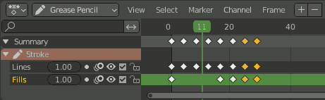

# Greasepencil Nudge Frames

## Warning: this is the repo for the addon for GP 2 (up to Blender 4.2)

**For the extension for GP 3 (Blender 4.3 or later), development is on Codeberg: [https://codeberg.org/bergamote/GP_nudge_frames](https://codeberg.org/bergamote/GP_nudge_frames)**

---

A simple [Blender](http://blender.org) add-on to modify the length (exposure) of greasepencil frames.  

### Install

Go to `Edit > Preferences > Add-ons > Install...` then navigate to the `greaspencil_nudge_frames` folder. Select `greasepencil_nudge_frames.py` and confirm, then enable it with the checkbox.

### Usage

With the mouse over the Grease Pencil Dopesheet, press:

- `D` to shorten by 1 frame
- `F` to extend by 1 frame

The shortcuts change the length of the displayed frame(s) for **every** unlocked layers in **all** selected GP objects. Make sure you isolate the layer you want to affect or lock the ones you want to keep in place.

I tried to make sure that frames aren't overwritten by accident, so when the current keyframe in any unlocked layer (even if hidden) is only one frame away from the next, the `D` shortcut is disabled. Even so, this is my first add-on so use at your own risks and all that.
